# AND
## Struktur Query
```mysql
SELECT kolom1,kolom2 FROM [nama_table] WHERE kolom1="nilai1" AND kolom2="nilai2";
```

```mysql
SELECT warna,pemilik FROM mobil_rental WHERE warna="Hitam" AND pemilik="Ibrahim";
```
## Hasil

## Analisis  
1. `select` query yang digunakan untuk menampilkan masukan dari `insert`
2. `warna,pemilik` merupakan nama kolom dari mobil
3. `from` query yang digunakan untuk memberi tanda bahwa tabel mana yang akan di tampilak
4. `where` query yang digunakan untuk memberikan sebuah kondisi
5. `warna='hitam' and pemilik='ibrahim'` merupakan sebuah kondisi untuk query dan `and` digunakan untuk memberikan syarat yang keduanya harus di penuhi 
## Kesimpulan
Query tersebut digunakan untuk menyeleksi yang mana  perintah yang akan ditampikan

# OR
## Struktur Query
```mysql
SELECT kolom1,kolom2 FROM [nama_tabel] WHERE kolom1="nilai1" OR kolom2="nilai2";
```

```mysql
SELECT warna,pemilik FROM mobil_rental WHERE warna="Hitam" OR pemilik="Ibrahim";
```

## Hasil


## Analisis
1. `select` query yang digunakan untuk menampilkan masukan dari `insert`
2. `warna,pemilik` merupakan nama kolom dari mobil
3. `from` query yang digunakan untuk memberi tanda bahwa tabel mana yang akan di tampilak
4. `where` query yang digunakan untuk memberikan sebuah kondisi
5. `warna='hitam' or pemilik='ibrahim'` merupakan sebuah kondisi untuk query dan `or` digunakan untuk memberikan syarat yang salah satunya harus di penuhi 
## Kesimpulan
Query tersbut digunakan untuk menyeleksi dan menampilkan yang hanya warna hitam dan pemilik ibrahim yang akan ditampilkan.

# BETWEEN
## Struktur Query
```mysql
SELECT * FROM [nama_tabel] WHERE kolom1 BETWEEN nilai1 AND nilai2;
```

```mysql
SELECT * FROM mobil_rental WHERE harga_rental BETWEEN 50000 AND 100000;
```
## Hasil

## Analisis
1. `select` query yang digunakan untuk menampilkan masukan dari `insert`
2. `*`  berarti semua kolom akan di tampilkan
3. `from` untuk memberikan tanda bahwa table mana yang akan di tampilkan
4. `mobil_rental` nama table yang akan di tampilkan
5. `where` untuk memberikan sebuah kondisi
6. `harga_rental` nama kolom yang digunakan untuk mengkondisikan sebuah table
7. `between` Ini adalah operator yang digunakan untuk memilih rentang nilai
8. `50000 and 100000` Ini adalah nilai rentang yang digunakan dalam kriteria pemilihan data

## Kesimpulan
Query ini digunnakan untuk menyeleksi harga rental dan hanya akan menampilkan harga 50.000 dan 100.000

# NOT BETWEEN
## Struktur Query
```mysql
SELECT * FROM [nama_tabel] WHERE kolom1 NOT BETWEEN nilai1 AND nilai2;
```

```mysql
SELECT * FROM mobil_rental WHERE harga_rental NOT BETWEEN 100000 AND 150000;
```

## Hasil

## Analisis
1. `select` query yang digunakan untuk menampilkan masukan dari `insert`
2. `*`  berarti semua kolom akan di tampilkan
3. `from` untuk memberikan tanda bahwa table mana yang akan di tampilkan
4. `mobil_rental` nama table yang akan di tampilkan
5. `where` untuk memberikan sebuah kondisi
6. `harga_rental` nama kolom yang digunakan untuk mengkondisikan sebuah table
7. `not between` Ini adalah operator yang digunakan untuk memilih nilai di luar rentang tertentu.
8. `100000 and 150000` Ini adalah nilai rentang yang digunakan dalam kriteria pemilihan data
## Kesimpulan
Query ini digunakan untuk menyeleksi harga rentalnya  dan tidak akan menampilkan 100.000 dan  150.000 dan hanya akan menampilkan 50.000

# <=
## Struktur Query
```mysql
SELECT * FROM [nama_tabel] WHERE kolom1 <= nilai1;
```

```mysql
SELECT * FROM mobil_rental WHERE harga_rental <= 100000;
```
## Hasil

## Analisis
. `select` query yang digunakan untuk menampilkan hasil dari `insert`
2. `*` arti nya semua kolom akan ditampilkan
3. `from` query yang digunakan untuk memberikan penanda bahwa table mana yang akan di tampilkan
4. `mobil_rental` nama table yang akan ditampilkan
5. `where` query yang digunakan untuk memberikan sebuah kondisi
6. `harga_rental<=100000` sebuah kondisi yang telah di berikan dan `harga_rental` itu nama kolom, `<=` merupakan operator, dan `100000`merupakan sebuah nilai
## Kesimpulan
Query tersebut akan menyeleksi dan akan menampilkan jika harga rental dibawah atau sama dengan 100.000 akan ditampilkan

# >=
## Struktur Query
```mysql
SELECT * FROM [nama_mobil] WHERE kolom1 >= nilai1;
```

```mysql
SELECT * FROM mobil_rental WHERE harga_rental >= 100000;
```
## Hasil

## Analisis
1. `select` query yang digunakan untuk menampilkan hasil dari `insert`
2. `*` arti nya semua kolom akan ditampilkan
3. `from` query yang digunkan untuk memberikan penanda bahwa table mana yang akan di tampilkan
4. `mobil_rental` nama table yang akan ditampilkan
5. `where` query yang digunakan untuk memberikan sebuah kondisi
6. `harga_rental>=100000` sebuah kondisi yang telah di berikan dan `harga_rental` itu nama kolom, `>=` merupakan operator, dan `100000`merupakan sebuah nilai
## Kesimpulan
Query tersebut akan menyeleksi  dan akan menampilkan jika harga rental llebih  besar atau  sama dengan 100.000  yang 
# <> atau !=
## Struktur Query
```mysql
SELECT * FROM [nama_tabel] WHERE kolom1 <> nilai1;
SELECT * FROM [nama_tabel] WHERE kolom1 != nilai1;
```

```mysql
SELECT * FROM mobil_rental WHERE harga_rental <> 100000
SELECT * FROM mobil_rental WHERE harga_rental != 50000;
```

## Hasil
## Analisis
1. `select` query yang digunakan untuk menampilkan hasil dari `insert`
2. `*` arti nya semua kolom akan ditampilkan
3. `from` query yang digunkan untuk memberikan penanda bahwa table mana yang akan di tampilkan
4. `mobil_rental` nama table yang akan ditampilkan
5. `where` query yang digunakan untuk memberikan sebuah kondisi
6. `harga_rental<>100000` sebuah kondisi yang telah di berikan dan `harga_rental` itu nama kolom, `<>` merupakan operator, dan `100000` merupakan sebuah nilai

1. `select` query yang digunakan untuk menampilkan hasil dari `insert`
2. `*` arti nya semua kolom akan ditampilkan
3. `from` query yang digunkan untuk memberikan penanda bahwa table mana yang akan di tampilkan
4. `mobil_rental` nama table yang akan ditampilkan
5. `where` query yang digunakan untuk memberikan sebuah kondisi
6. `harga_rental!=50000` sebuah kondisi yang telah di berikan dan `harga_rental` itu nama kolom, `!=` merupakan operator, dan `50000`merupakan sebuah nilai
## Kesimpulan
dari kedua contoh operator kita bisa menyimpulkan bahwa operator `!=` dengan `<>` memiliki arti yang sama yang dimana jika ingin menampilakan table dengan menggunakan sebauh nilai maka nilai yang ingin di tampilakan tidak boleh sama dengan nilai yang telah di tentukan
# Tantangan login
## Struktur Query
```mysql
select nama_kolom1 from nama_tabel 
where nama_kolom2=nilai;
```

```mysql
SELECT pemilik FROM mobil_rental where no_plat="B 1611 QC";
```

## Hasil
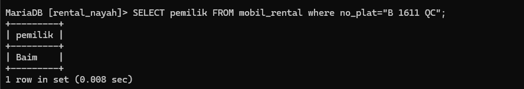
## Analisis
1.  `select` digunakan untuk menampilkan sebuah tabel
2. `pemilik` nama kolom yang akan ditampilkan
3. `from` digunakan untuk memberikan sebuah tanda ke tabel yang akan di tampilkan
4. `mobil_rental` nama tabel yang akan ditampilkan
5. `where` digunakan untuk memberikan suatu kondisi
6. `no_plat="B 1611 QC"` adalah sebuah kondisi yang akan di eksekusi
## Kesimpulan
query ini digunakan untuk mencari pemilik jikalau yang ditau hanya no plat nya saja
# IN
### Struktur Query
```mysql
SELECT * FROM [nama_table] WHERE [nama_kolom] IN ("nilai1","nilai2");
```

```mysql
SELECT * FROM mobil_rental WHERE warna IN("Silver","Merah");
```
### Hasil 

### Analisis
1. `SELECT *` artinya kita akan mengambil semua kolom dari tabel "mobil".
2. `FROM mobil_rental` artinya kita akan mengambil data dari tabel "mobil".
3. `WHERE warna IN ('silver', 'Merah')` artinya kita hanya akan mengambil baris-baris di mana nilai kolom "warna" adalah "merah" atau "Silver".
### Kesimpulan
Query ini digunakan untuk menyeleksi warna nya dan akan menampilkan warna silver dan merah

## IN + AND
### Struktur Query
```mysql
SELECT * FROM [nama_tabel]
WHERE [nama_kolom1] IN("nilai1","nilai2")
AND [nama_kolom2] = nilai;
```

```mysql
SELECT * FROM mobil_rental
WHERE warna IN("Silver","Merah")
AND harga_rental = 50000;
```

### Hasil


### Analisis
1.  `SELECT *` artinya kita akan mengambil semua kolom dari tabel "mobil".
2. `FROM mobil_rental` artinya kita akan mengambil data dari tabel "mobil".
3. `WHERE warna IN ('silver', 'Merah')` artinya kita hanya akan mengambil baris-baris di mana nilai kolom "warna" adalah "merah" atau "Silver".
4. `AND harga_rental = 50000` artinya kita hanya akan mengambil baris-baris di mana nilai kolom "harga_rental" adalah 50000.
### Kesimpulan
query tersebut akan menyeleksi kolom warna dan harga rental dan hanya akan menampilkan warna silver atau meraah dan akan menampilkan harga rental 50.000

## IN + OR 
### Struktur Query
```mysql
SELECT * FROM [nama_tabel]
WHERE [nama_kolom1] IN ('nilai1','nilai2')
OR [nama_kolom2] = nilai1;
```

```mysql
SELECT * FROM mobil_rental
WHERE warna IN ('Hitam','Silver')
OR harga_rental = 150000;
```

### Hasil

### Analisis
1. `SELECT *` artinya kita akan mengambil semua kolom dari tabel "mobil".
2. `FROM mobil_rental` artinya kita akan mengambil data dari tabel "mobil".
3. `WHERE warna IN ('Hitam', 'silver')` artinya kita hanya akan mengambil baris-baris di mana nilai kolom "warna" adalah "Hitam" atau "Silver".
4. `OR harga_rental  150000` artinya kita juga akan mengambil baris-baris di mana nilai kolom "harga_rental"  150000.
### Kesimpulan
Query tersebut akan menyeleksi kolom harga rental dan warna  dan akan menampilkan harga rental 150.000 dan warna silver atau hitam

## IN + AND + OPERATOR 
### Struktur Query
```mysql
SELECT * FROM [nama_tabel]
WHERE [nama_kolom1] IN ('nilai1','nilai2')
AND [nama_kolom2] > nilai1;

SELECT * FROM [nama_tabel]
WHERE [nama_kolom1] IN ('nilai1','nilai2')
AND [nama_kolom2] < nilai1!;
```

```mysql
SELECT * FROM mobil_rental
WHERE warna IN ('Hitam','Silver')
AND harga_rental > 50000;

SELECT * FROM mobil_rental
WHERE warna IN ('Hitam','Silver')
AND harga_rental < 150000;
```

### Hasil

### Analisis
1. `SELECT *` artinya kita akan mengambil semua kolom dari tabel "mobil".
2. `FROM mobil_rental` artinya kita akan mengambil data dari tabel "mobil".
3. `WHERE warna IN ('Hitam', 'silver')` artinya kita hanya akan mengambil baris-baris di mana nilai kolom "warna" adalah "Hitam" atau "Silver".
4. `AND harga_rental > 50000` artinya kita juga akan mengambil baris-baris di mana nilai kolom "harga_rental" lebih besar dari 50000.
5. `AND harga_rental < 150000` artinya kita juga akan mengambil baris-baris di mana nilai kolom "harga_rental" lebih kecil dari 150000.

### Kesimpulan
query tersebut akan menyeleksi warna dan harga rental dan akan menampilkan warna hitam dan silver dan akan menampilkan harga 100.000


# Like
## Mencari Awalan
### Struktur Query
```mysql
SELECT * FROM nama_tabel
where pemilik like `ib%`
```

```MYSQL
SELECT * FROM mobil_rental
where pemilik like 'ib%'
```
### Hasil
.png)
### Analisis
1. `SELECT *` artinya kita akan mengambil semua kolom dari tabel "mobil".
2. `FROM mobil_rental` artinya kita akan mengambil data dari tabel "mobil".
3. `WHERE pemilik LIKE 'Ib%'` artinya kita hanya akan mengambil baris-baris di mana nilai kolom "pemilik" dimulai dengan kata "Ib" (dilanjutkan dengan karakter apa pun, karena simbol `%` dalam pola pencocokan).
### Kesimpulan
Mencari awalan digunakan agar mempermudah pengguna jika ingin mencari kolom tertentu , misal mencari awalan pemilik maka yang dimasukkan ialah awalan nama dari kolom tersebut.
## Mencari Akhiran
### Struktur Query
```mysql
SELECT * FROM mobil
WHERE pemilik like `%m`;
```

```mysql
SELECT * FROM mobil
WHERE pemilik like `%m`;
```

### Hasil
%201.png)
### Analisis
1. `SELECT *` artinya kita akan mengambil semua kolom dari tabel "mobil".
2. `FROM mobil_rental` artinya kita akan mengambil data dari tabel "mobil".
3. `WHERE pemilik LIKE '%m'` artinya kita hanya akan mengambil baris-baris di mana nilai kolom "pemilik" diakhiri dengan huruf "m" (dimulai dengan karakter apa pun, karena simbol `%` sebelum "m" dalam pola pencocokan).
### Kesimpulan
Mencari akhiran digunakan agar mempermudah pengguna jika ingin mencari kolom tertentu , misal mencari akhiran pemilik maka yang dimasukkan ialah akhiran nama dari kolom tersebut.


## Mencari Awalan & Akhiran
### Struktur Query
```mysql
SELECT * FROM mobil
where pemilik like `b%m`
```

```mysql
SELECT * FROM mobil_rental
where pemilik like `i%m`;
```
### Hasil
.png)
### Analisis
1. `SELECT *` artinya kita akan mengambil semua kolom dari tabel "mobil".
2. `FROM mobil_rental` artinya kita akan mengambil data dari tabel "mobil".
3. `WHERE pemilik LIKE 'i%m'` artinya kita hanya akan mengambil baris-baris di mana nilai kolom "pemilik" dimulai dengan huruf "i", diikuti oleh setidaknya satu karakter apa pun (dilambangkan oleh simbol `%`), dan diakhiri dengan huruf "m".

### Kesimpulan
mencari awalan dan akhiran digunakan untuk mencari data pelanggan agar lebih mudah,hanya dengan memasukkan awalan nama dan akhiran nama pemilik tersebut

## Mencari Total Karakter
### Struktur Query
```mysql
SELECT * FROM MOBIL
WHERE PEMILIK LIKE `I__`;
```

```MYSQL
SELECT * FROM MOBIL
WHERE PEMILIK LIKE `___`;
```

```MYSQL
SELECT * FROM MOBIL_RENTAL
WHERE PEMILIK LIKE `I__`;
```

```MYSQL
SELECT * FROM MOBIL_RENTAL
WHERE PEMILIK LIKE `___`;
```

### Hasil
.png)
.png)
### Analisis
1. `SELECT *` artinya kita akan mengambil semua kolom dari tabel "mobil".
2. `FROM mobil_rental` artinya kita akan mengambil data dari tabel "mobil".
3. `WHERE pemilik LIKE 'I__'` artinya kita hanya akan mengambil baris-baris di mana nilai kolom "pemilik" terdiri dari 3 karakter, di mana karakter pertama adalah "I" (dilambangkan oleh underscore `_`) dan dua karakter berikutnya adalah karakter apa pun.
4.  `WHERE pemilik LIKE '___'` artinya kita hanya akan mengambil baris-baris di mana nilai kolom "pemilik" terdiri dari 3 karakter, di mana 3 karakternya adalah karakter apapun  (dilambangkan oleh underscore `_`)

### Kesimpulan
mencari total karakter digunakan pengguna untuk mencari data pelangannya,hanya dengan memasukkan garis bawah sebanyak karakter nama yang ingin dicari


## Kombinasi
### Struktur  Query
```mysql
SELECT * FROM MOBIL
WHERE PEMILIK LIKE `__r%`;
```

```MYSQL
SELECT * FROM MOBIL
WHERE PEMILIK LIKE `__i%`;
```
### Hasil
.png)
### Analisis
1. `SELECT *` artinya kita akan mengambil semua kolom dari tabel "mobil".
2. `FROM mobil_rental` artinya kita akan mengambil data dari tabel "mobil".
3. `WHERE pemilik LIKE '__i%'` artinya kita hanya akan mengambil baris-baris di mana nilai kolom "pemilik" terdiri dari setidaknya 3 karakter, di mana dua karakter pertama adalah karakter apa pun (dilambangkan oleh dua underscore `_`), karakter ketiga adalah "i", dan karakter-karakter berikutnya adalah karakter apa pun (dilambangkan oleh simbol `%`).
### Kesimpulan
kombinasi digunakan untuk mencari data pelanggan , hanya dengan memasukkan garis bawa sebanyak nama pelanggan tersebut kemudian memasukkan nama tengah dari nama pelanggan tersebut dan persen digunakan untuk mencari karakter apapun 

## Not Like
### Struktur Query
```mysql
SELECT * FROM MOBIL WHERE PEMINJAM NOT LIKE `A%`;
```

```MYSQL
SELECT * FROM MOBIL_RENTAL
WHERE PEMINJAM NOT LIKE 'a%';
```
### Hasil
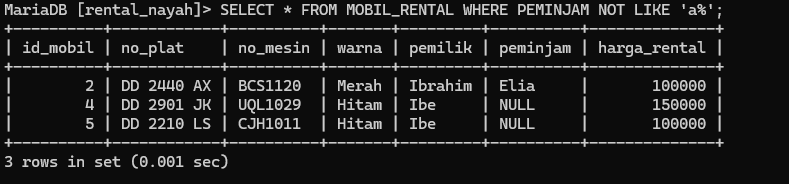
### Analisis
1. `select *` artinya kita akan mengambil semua kolom dari tabel "mobil".
2. `FROM mobil_rental` artinya kita akan mengambil data dari tabel "mobil".
3. `WHERE peminjam NOT LIKE 'a%` artinya kita hanya akan mengambil baris-baris di mana nilai kolom "peminjam" terdiri dari huruf depan A, dan selain nama depan huruf A tidak akan menampilkan peminjamnya.
### Kesimpulan
Kesimpulan `"SELECT * FROM mobil_rental WHERE peminjam NOT LIKE 'A%'"` adalah bahwa query tersebut akan mengembalikan semua data dari tabel "mobil" dimana nilai kolom "peminjam" tidak dimulai dengan huruf 'A'.


## Null & Not Null
### Struktur Query
Mencari Data Kosong
```mysql
SELECT * FROM MOBIL 
WHERE PEMINJAM IS NULL;
```
Mencari Data Yang Tidak Kosong
```mysql
SELECT * FROM MOBIL
WHERE PEMINJAM IS NOT NULL;
```

```MYSQL
SELECT * FROM MOBIL_RENTAL
WHERE PEMINJAM IS NULL;
```

```MYSQL
SELECT * FROM MOBIL_RENTAL
WHERE PEMINJAM IS NOT NULL;
```

### Hasil
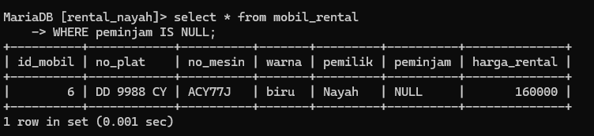

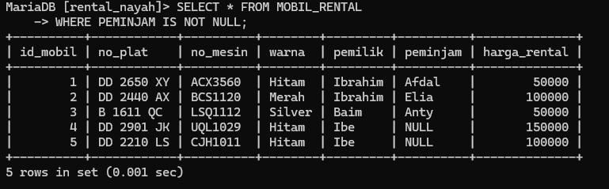
### Analisis
- `SELECT` : Menginstruksikan untuk memilih semua kolom (atribut) dari tabel `mobil`.
- `FROM mobil_rental`: Mendefinisikan tabel tempat data akan diambil, yaitu tabel `mobil_rental`.
- `WHERE peminjam IS NULL`: Ini adalah klausa `WHERE` yang memfilter data berdasarkan kondisi tertentu.
- `peminjam`: Merujuk pada kolom pada tabel `mobil` yang kemungkinan berisi nama peminjam kendaraan.
- `IS NULL`: Operator perbandingan yang mengecek apakah nilai pada kolom `peminjam` adalah `NULL`.
- `WHERE peminjam IS NOT NULL`: Ini adalah klausa WHERE yang digunakan untuk menerapkan kondisi pada kueri. Kondisi yang diterapkan di sini adalah "peminjam IS NOT NULL", yang berarti hanya baris-baris di mana kolom "peminjam" tidak kosong atau memiliki nilai yang tidak NULL akan dipilih.
### Kesimpulan
Digunakan untuk mengambil semua baris dari tabel  `"mobil"`  di mana kolom  `"peminjam"`  memiliki nilai yang tidak NULL. Hasilnya akan berisi semua kolom dari baris-baris ini.
Digunakan untuk mengambil semua baris dari tabel  `"mobil"`  di mana kolom  `"peminjam"`  memiliki nilai yang tidak NULL. Hasilnya akan berisi semua kolom dari baris-baris ini.
### Kesimpulan
- Perintah ini hanya mengembalikan mobil dengan kolom `peminjam` bernilai **NULL** (tidak ada data peminjam).
- Perintah ini membantu dalam mengidentifikasi mobil yang tersedia untuk dipinjam.
- Hasilnya bergantung pada data yang ada di kolom `peminjam` pada tabel `mobil`.

## Order By & Limit
### Struktur Query
Mengurutkan Data Dari Data Terkecil
```mysql
SELECT * FROM MOBIL 
ORDER BY PEMILIK ASC;
```

Mengurutkan Data Dari Data Terbesar
```mysql
SELECT * FROM MOBIL 
ORDER BY PEMILIK DESC;
```

```MYSQL
SELECT * FROM MOBIL_RENTAL
ORDER BY PEMILIK ASC;
```

```MYSQL
SELECT * FROM MOBIL_RENTAL
ORDER BY PEMILIK DESC;
```

Membatasi Data yang Tampil
```MYSQL
SELECT * FROM nama_tabel WHERE nama_tabel = "data_tabel" ORDER BY nama_data ASC LIMIT jumlah_limit;
```

```mysql
select * from daftar_mobil where warna = "Hitam" order by harga_rental asc limit 2;
```
### Hasil
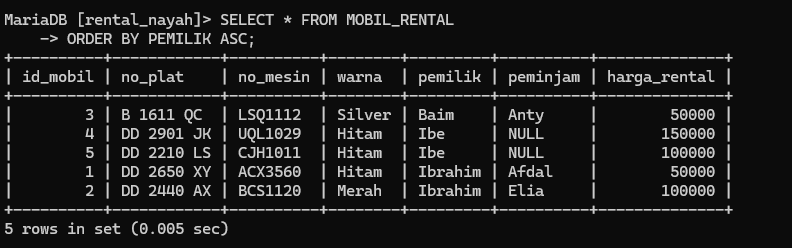

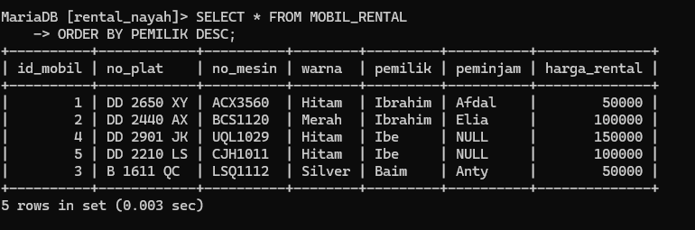

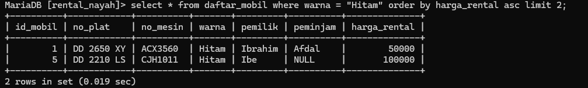
### Analisis
- `ASC` adalah pengurutan dari terkecil ke terbesar
- `DESC` adalah pengurutan dari terbesar ke terkecil
- `limit` membatasi data yang tampil
- - `SELECT *`: Ini adalah klausa SELECT yang digunakan untuk memilih semua kolom dari tabel "mobil". Dengan menggunakan tanda bintang (*), kita memilih semua kolom yang ada dalam tabel.
- `FROM mobil_rental`: Ini adalah klausa FROM yang menentukan tabel yang akan digunakan dalam kueri. Dalam hal ini, tabel yang digunakan adalah "mobil_rental".
- `ORDER BY pemilik ASC`: Ini adalah klausa ORDER BY yang digunakan untuk mengurutkan hasil berdasarkan kolom "pemilik" secara menaik (ascending). Dengan menggunakan ASC, hasil akan diurutkan dari nilai terkecil hingga terbesar berdasarkan kolom "pemilik".
-  `ORDER BY peminjam DESC`: Ini adalah bagian penting dari perintah yang akuntansi database untuk mengurutkan hasil berdasarkan kolom "peminjam" secara menurun (urutan menurun). Artinya, hasilnya akan diurutkan dari nilai yang paling tinggi ke nilai yang paling rendah pada kolom "peminjam".
### Kesimpulan
- `SELECT * FROM mobil` mengambil semua data dari tabel `mobil`.
- `ORDER BY pemilik ASC` mengurutkan data berdasarkan kolom `pemilik` secara ascending (terkecil ke besar)
- - `ORDER BY pemilik DESC`mengurutkan data berdasarkan kolom `pemilik` (terbesar ke kecil)
 
# Distinct
### Struktur Query
```mysql
SELECT DISTINCT(PEMILIK) FROM MOBIL;
```

```MYSQL
SELECT DISTINCT(HARGA_RENTAL) FROM MOBIL ORDER BY HARGA_RENTAL DESC;
```

```MYSQL
SELECT DISTINCT(PEMILIK) FROM MOBIL_RENTAL;
```

```MYSQL
SELECT DISTINCT(HARGA_RENTAL) FROM MOBIL_RENTAL ORDER BY HARGA_RENTAL DESC;
```
### Hasil
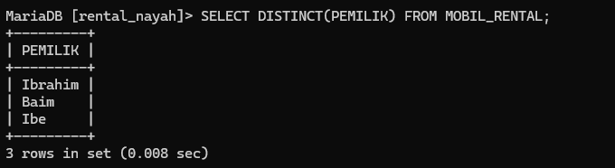

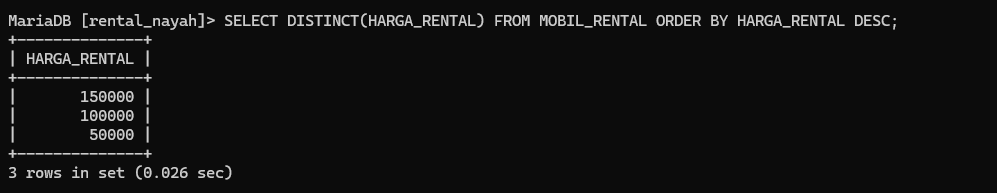
### Analisis
- `distinct` menyeleksi data yang duplikat
- - `SELECT DISTINCT (harga_rental)` : Ini adalah klausul SELECT yang digunakan untuk memilih kolom "harga_rental". Kata kunci "DISTINCT" digunakan untuk mengambil nilai unik dari kolom tersebut.
- `FROM mobil_rental` : Ini adalah klausul FROM yang menentukan tabel yang digunakan dalam query, yaitu "mobil_rental".
- `ORDER BY harga_rental DESC` : Ini adalah klausul ORDER BY yang digunakan untuk mengurutkan hasil berdasarkan kolom "harga_rental" secara menurun (descending order). Dengan kata lain, hasilnya akan ditampilkan dari harga_rental yang tertinggi ke terendah.
## Kesimpulan
Kesimpulannya, hasil query akan mengembalikan nilai unik dari kolom "harga_rental" dari tabel "mobil", diurutkan dari nilai terbesar ke terkecil. Ini akan memberikan daftar harga rental yang berbeda yang tersedia untuk mobil, tanpa duplikasi, dalam urutan terurut

# Concat,Concat_Ws,As
### Struktur Query
Menggabungkan Kolom Tanpa Pemisah
```mysql
select concat(pemilik,warna) from mobil;
```

```mysql
select concat(pemilik,warna) from mobil_rental;
```

Menggabungkan kolom dengan pemisah
```mysql
select  concat_ws("-",no_plat,no_mesin,id_mobil) from mobil;
```

```mysql
select contat_ws("-",pemilik,warna) fromm mobil_rental;
```

Memberikan nama kolom alias
```mysql
SELECT CONCAT_WS("+",pemilik,peminjam) AS COLLAB FROM mobil;
```

```mysql
SELECT CONCAT_WS("+",pemilik,warna) AS COLLAB FROM mobil_rental;
```

### Hasil
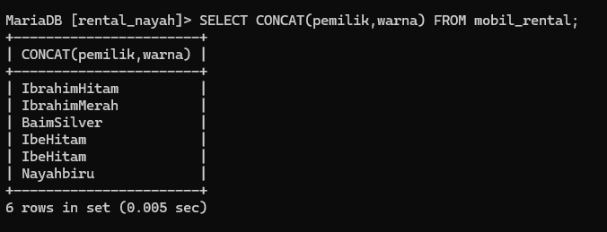

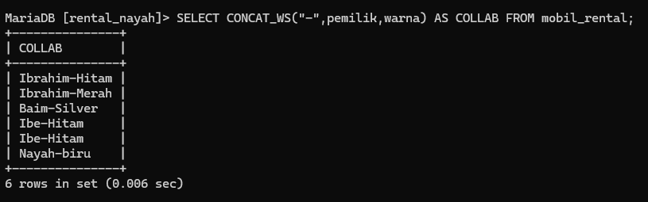

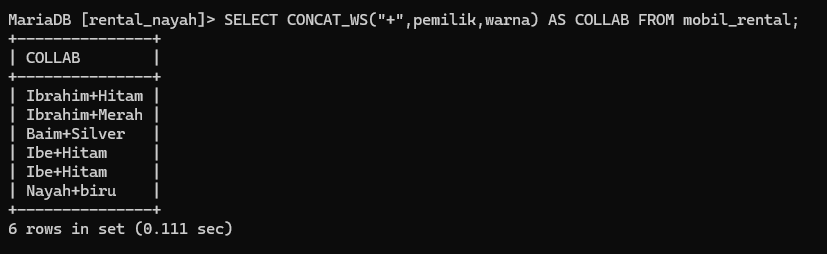
### Analisis 
- `SELECT` digunakan untuk memilih kolom yang ingin ditampilkan.
- `CONCAT()` menggabungkan dua nilai string menjadi satu.
- `pemilik` dan `warna` adalah kolom dari tabel `mobil_rental`.
- **`CONCAT_WS`** berfungsi untuk menggabungkan beberapa nilai string menjadi satu string, dipisahkan dengan separator yang ditentukan.
    - **`WS`** artinya "With Space" (dengan spasi).
    - **`"-"`** adalah pembatas yang digunakan dalam kueri ini (bisa diganti dengan karakter lain).
**`CONCAT_WS`** berfungsi untuk menggabungkan dua nilai string menjadi satu string, dipisahkan dengan separator yang ditentukan.
    - **`WS`** artinya "With Space" (dengan spasi).
    - **`+`** adalah pembatas yang digunakan dalam kueri ini (bisa diganti dengan karakter lain).
### Kesimpulan
Kesimpulan dari pernyataan SQL `SELECT CONCAT_WS("+", pemilik, peminjam) AS COLLAB FROM mobil_rental;` adalah bahwa Anda sedang menggabungkan kolom pemilik dan peminjam dalam tabel mobil menjadi satu string dengan menggunakan tanda tambah (+) sebagai pemisah.

# View
### Struktur Query
Membuat Tabel Virtual
```mysql
Create View Info_no_plat AS
Select id_mobil, no_plat, pemilik, peminjam
from mobil
Where pemilik = "Ibrahim";
```

```mysql
Create View Info_no_plat AS
    -> Select id_mobil, no_plat, pemilik, peminjam
    -> from mobil_rental
    -> Where pemilik = "Ibrahim";
```

Menampilkan Tabel Virtual
```mysql
Select * From Info_no_plat;
```

```mysql
Select * From Info_no_plat;
```

Menghapus  Tabel Virtual
```mysql
Drop View info_no_plat:
```

```mysql
Drop View info_no_plat:
```

### Hasil
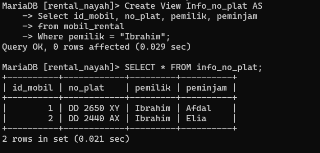

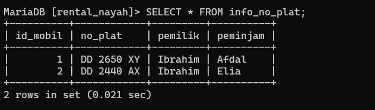

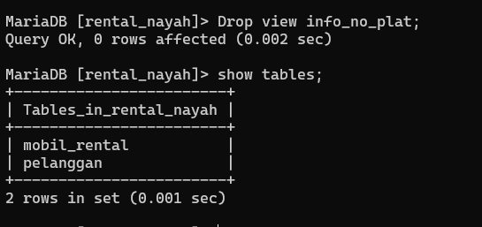
### Analisis
- **`CREATE VIEW`** digunakan untuk membuat view baru.
- **`info_no_plat`** adalah nama view yang dibuat.
- **`SELECT`** digunakan untuk memilih kolom yang ingin ditampilkan dalam view.
- **`id_mobil`, `no_plat`, `pemilik`, dan `peminjam`** adalah kolom yang ditampilkan dalam view.
- **`FROM`** menunjukkan tabel sumber data, yaitu `mobil`.
- **`WHERE`** digunakan untuk menyaring data berdasarkan kondisi, yaitu `pemilik = "Ibrahim"`.
- `FROM info_no_plat` menunjukkan bahwa data akan diambil dari view `info_no_plat`.
-  `DROP VIEW`: Ini adalah perintah yang digunakan untuk menghapus view dari database. Dalam hal ini, perintah ini digunakan untuk menghapus view "info_no_plat".
- `info_no_plat`: Ini adalah nama view yang akan dihapus. Nama ini harus sesuai dengan nama view yang ingin Anda hapus.
### Kesimpulan
Kesimpulan dari `CREATE VIEW info_no_plat AS SELECT id_mobil, no_plat, pemilik, peminjam FROM mobil WHERE pemilik = "Ibrahim";` adalah bahwa Anda sedang membuat sebuah view dengan nama "info_no_plat". View ini akan menampilkan kolom-kolom id_mobil, no_plat, pemilik, dan peminjam dari tabel mobil hanya untuk baris-baris di mana nilai kolom pemilik adalah "Ibrahim".
perintah `SELECT *`, Anda memilih semua kolom yang ada dalam view `info_no_plat`. Hasilnya akan mengembalikan semua baris yang memenuhi kondisi `pemilik = "Ibrahim"` dari tabel `mobil`, termasuk semua kolom yang ada dalam view tersebut.
Perintah `DROP VIEW` digunakan untuk menghapus view yang telah dibuat sebelumnya. Dalam hal ini, perintah tersebut akan menghapus view "info_no_plat" dari database. Setelah perintah dijalankan, view tersebut tidak akan lagi tersedia dan tidak dapat digunakan untuk mengambil data.

# Agregasi
## Sum
### Struktur Query
```mysql
Select Sum(namakolom) AS total
From nama_tabel
where kondisi_opsional;
```

```mysql
select sum(harga_rental) from mobil_rental;
```

### Hasil
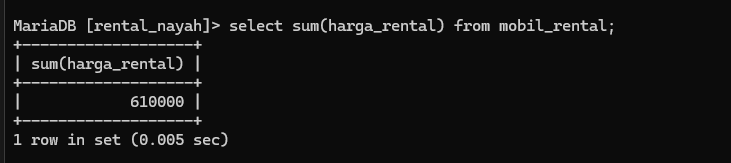
### Analisis
- `SELECT`: Digunakan untuk mengambil data dari database.
- `SUM()`: Fungsi agregat dalam SQL yang digunakan untuk menghitung jumlah nilai dalam kolom.
- `harga_rental`: Ini adalah nama kolom yang ingin Anda hitung jumlahnya.
- `FROM mobil_rental`: Menentukan tabel dari mana Anda ingin mengambil datanya, dalam hal ini, tabel bernama `mobil`.
### Kesimpulan
perintah `sum` digunakan untuk menghitung total dari nilai2 numerik dalam suatu kolom.Ini sering digunakan bersama dengn pernyataan `select` untuk mengambil hasil agregasi dari data dalam tabel.

## Count
### Struktur Query
count pemilik :
```MYSQL
SELECT COUNT(*) AS jumlah
FROM nama_tabel
WHERE kondisi_opsional;
```

```mysql
select count(pemilik) from mobil_rental;
```
 
count peminjam:
```mysql
select count(peminjam) from mobil_rental;
```
### Hasil
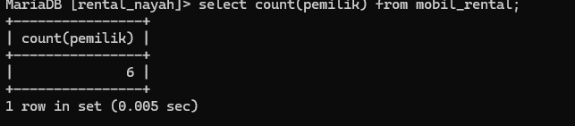
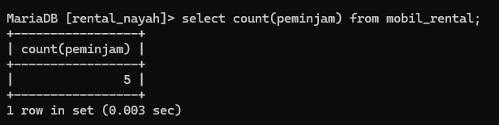
### Analisis
**pemilik**
- `SELECT` : Kata kunci ini digunakan untuk mengambil data dari database.
- `COUNT()` : Ini adalah fungsi agregat yang menghitung jumlah baris yang dikembalikan oleh kueri. Dalam hal ini, ia akan menghitung jumlah nilai bukan nol pada kolom "pemilik".
- `pemilik` : Ini nama kolomnya. Fungsi ini `COUNT()`akan menghitung jumlah nilai bukan nol di kolom ini.
- `FROM mobil_rental` : Ini menentukan tabel dari mana data akan diambil. Dalam hal ini, itu adalah tabel "mobil".
**peminjam**
- `SELECT`: Kata kunci ini digunakan untuk mengambil data dari database.
- `COUNT(peminjam)`: Fungsi ini menghitung jumlah nilai bukan nol pada kolom yang ditentukan, dalam hal ini, "peminjam".
- `FROM mobil_rental`: Ini menentukan tabel untuk mengambil data, dalam hal ini, tabel bernama "mobil".
### Kesimpulan
**pemilik**
Kesimpulan dari `SELECT COUNT(pemilik) FROM mobil_rental;` adalah bahwa Anda ingin menghitung jumlah entri unik dalam kolom "pemilik" dari tabel "mobil".

**peminjam**
Kesimpulan dari `SELECT COUNT(peminjam) FROM mobil_rental;` adalah bahwa Anda ingin menghitung jumlah entri unik dalam kolom "peminjam" dari tabel "mobil". Hasilnya akan memberikan jumlah peminjam mobil yang terdaftar dalam tabel. 

## Min
### Struktur Qery
```mysql
SELECT MIN(nama_kolom) AS nilai_minimum
FROM nama_tabel
WHERE kondisi_opsional;
```

```mysql
select min(harga_rental) as minimal from mobil_rental;
```

### Hasil
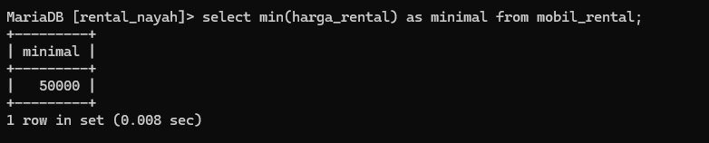
### Analisis
- `SELECT`: Menunjukkan bahwa ingin mengambil data dari database.
- `MIN(harga_rental)`: Menghitung nilai minimum kolom `harga_rental`.
- `AS MINIMAL`: Menetapkan alias `MINIMAL` pada hasil fungsi `MIN(harga_rental)`.
- `FROM mobil_rental`: Menentukan tabel `mobil`untuk mengambil data.
### Kesimpulan
Kesimpulan dari `SELECT MIN(harga_rental) AS MINIMAL FROM mobil_rental;` adalah bahwa Anda ingin mencari nilai terkecil (minimum) dari kolom "harga_rental" dalam tabel "mobil".
## Max
### Struktur Query
```mysql
SELECT MAX(nama_kolom) AS nilai_maximal
FROM nama_tabel
WHERE kondisi_opsional;
```

```mysql
select max(harga_rental) as minimal from mobil_rental;
```

### Hasil
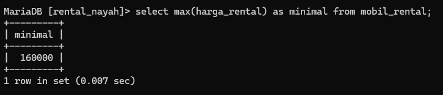
### Analisis
- `SELECT`: Digunakan untuk mengambil data dari database.
- `MAX(harga_rental)`: Fungsi ini menghitung nilai maksimum kolom 'harga_rental' dan mengambil nilai tertinggi yang ada di kolom itu.
- `AS MAXIMAL`: Mengubah nama hasil perhitungan `MAX(harga_rental)`menjadi 'MAXIMAL'. Itu adalah alias untuk hasilnya.
### Kesimpulan
Kesimpulan dari pernyataan SQL ini adalah bahwa Anda ingin mencari nilai terbesar (maksimum) dari kolom `"harga_rental" dalam tabel "mobil_rental"` . Hasilnya akan disajikan dengan menggunakan alias "MAXIMAL" dalam kolom hasil.
## AVG
### Struktur Query
```mysql
SELECT AVG(nama_kolom) AS rata_rata
FROM nama_tabel
WHERE kondisi_opsional;
```

```mysql
select avg(harga_rental) as rata_rata from mobil_rental;
```
### Hasil
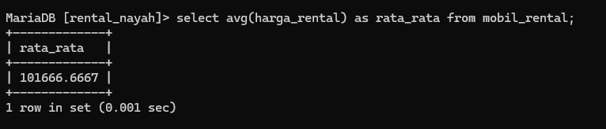
### Analisis 
- `SELECT AVG(harga_rental)`: Ini adalah perintah SQL yang digunakan untuk mengambil nilai rata-rata dari kolom `harga_rental`. `AVG()` adalah fungsi agregat yang digunakan untuk menghitung rata-rata dari sekumpulan nilai.
- `AS RATA_RATA`: Menggunakan kata kunci `AS` untuk memberi nama pada hasil rata-rata. Dalam hal ini, hasil rata-rata dari `harga_rental` akan dinamai `RATA_RATA`.
- `FROM mobil_rental`: Ini adalah bagian dari perintah SQL yang menunjukkan bahwa data diambil dari tabel bernama `mobil`. Jadi, perintah ini mengambil nilai rata-rata dari kolom `harga_rental` dari tabel `mobil`.
### Kesimpulan
Kesimpulan dari pernyataan SQL `SELECT AVG(harga_rental) AS RATA_RATA FROM mobil_rental;` adalah bahwa Anda ingin menghitung nilai rata-rata (average) dari kolom "harga_rental" dalam tabel "mobil".


# Hasil Tantangan
# Data Tabel Pegawai
	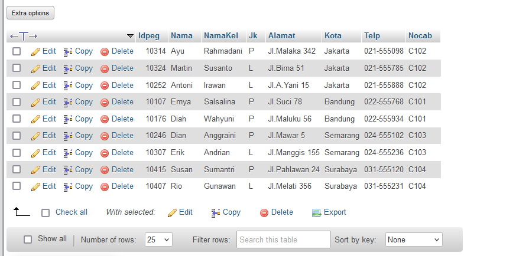
# Perubahan Struktur Tabel (PEGAWAI)
## Before
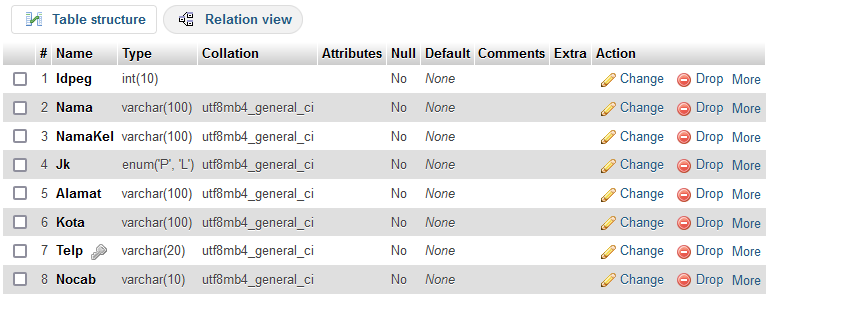
## After
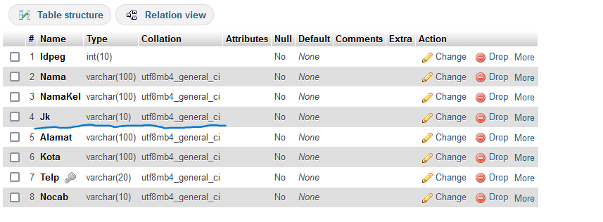

# Perubahan Data Tabel  (PEGAWAI)
## Before

## After
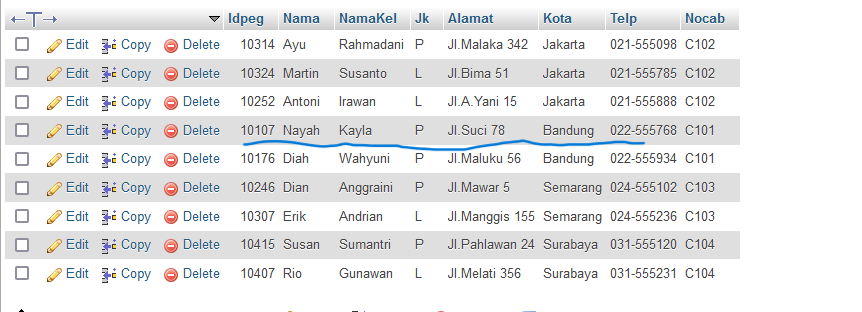

# Hasil Relasi Pegawai dan Cabang (designer)
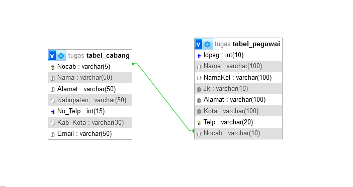
# Query Relasi dan Hasil
# Query Relasi
```PHP
SELECT s.nama, n.nilai
FROM nilai AS n
INNER JOIN siswa AS s ON s.nis = n.nis
WHERE n.nilai > 75;
```
## Hasil 
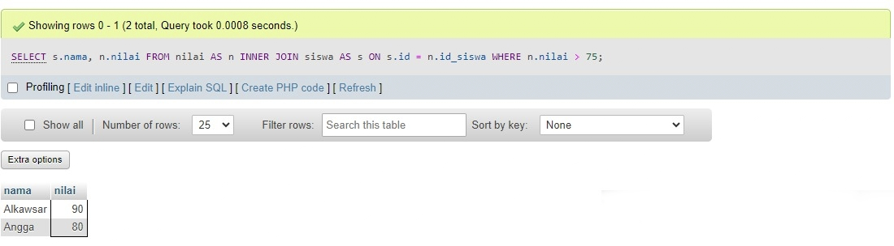


# Tugas Basis Data
## Tampilkan Jumlah data mobil dan kelompok kan berdasarkan warna nya sesuai dengan tabel mobil kalian
### Query 
```sql
SELECT warna, COUNT(*) AS jumlah_mobil
FROM mobil
GROUP BY warna;
```

### Analisis
- SELECT warna, COUNT(*) AS jumlah_mobil: Memilih kolom warna dan menghitung jumlah mobil (COUNT(*)) untuk setiap warna. Hasil perhitungan ini diberi alias jumlah_mobil.
- FROM mobil: Mengambil data dari tabel mobil.
- GROUP BY warna: Mengelompokkan hasil berdasarkan kolom warna.

### Hasil
 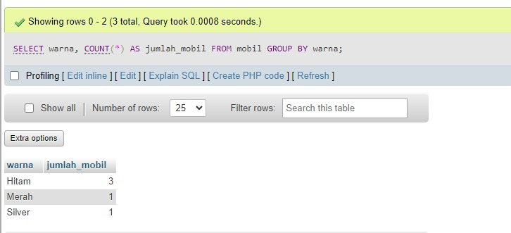

## Berdasarkan query ini tampilkan yang lebih Kecil dari 3 atau sama dengan 3 pemilik mobil nya
### Query
```sql
SELECT pemilik, COUNT(id_mobil) AS jumlah_mobil
FROM mobil
GROUP BY pemilik
HAVING COUNT(id_mobil) <= 3;
```

### Analisis
- SELECT pemilik, COUNT(id_mobil) AS jumlah_mobil:
- pemilik: Menampilkan nama pemilik mobil.
- COUNT(id_mobil) AS jumlah_mobil: Menghitung jumlah mobil yang dimiliki oleh setiap pemilik, dan menampilkan hasilnya dengan alias jumlah_mobil.
- FROM mobil:Mengambil data dari tabel mobil.
- GROUP BY pemilik:Mengelompokkan data berdasarkan kolom pemilik, sehingga setiap pemilik dikelompokkan bersama dengan jumlah mobil yang mereka miliki.
- HAVING COUNT(id_mobil) <= 3:Menyaring hasil kelompok untuk hanya menyertakan pemilik yang memiliki jumlah mobil kurang dari atau sama dengan 3.

### Hasil 
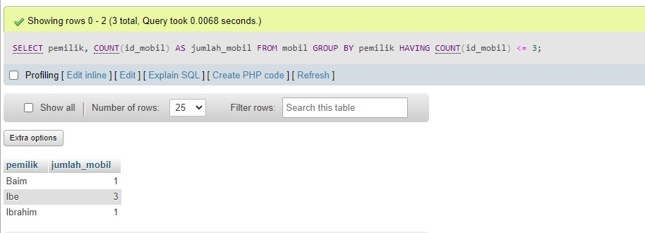

## Tampilkan smua pemilik dengan jumlah mobilnya yang memiliki atau sama dengan 3 mobil
### Query
```sql
SELECT pemilik, COUNT(id_mobil) AS jumlah_mobil
FROM mobil
GROUP BY pemilik
HAVING COUNT(id_mobil) >= 3;
```
### Analisis
- SELECT pemilik, COUNT(*) AS jumlah_mobil: Memilih kolom pemilik dan menghitung jumlah mobil (COUNT(*)) untuk setiap pemilik. Hasil perhitungan ini diberi alias jumlah_mobil.
- FROM mobil: Mengambil data dari tabel mobil.
- GROUP BY pemilik: Mengelompokkan hasil berdasarkan kolom pemilik.
- HAVING COUNT(*) >= 3: Menyaring hasil kelompok yang jumlah mobilnya lebih besar atau sama dengan 3.
### Hasil 
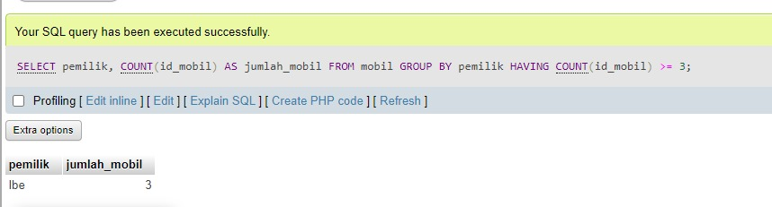

## Berdasarkan query yang ada pada praktikum 5 bagian 7 tampilkan data pada table mobil dengan mengelompokan berdasarkan pemiliknya.hitung menggunakan sum total pendapatan pemilik berdasarkan harga rental
### Query
```sql
SELECT pemilik, SUM(harga_rental) AS total_pendapatan
FROM mobil
GROUP BY pemilik;
```
### Analisis
- SELECT pemilik, SUM(harga_rental) AS total_pendapatan: Memilih kolom pemilik dan menghitung total pendapatan (SUM(harga_rental)) untuk setiap pemilik. Hasil perhitungan ini diberi alias total_pendapatan.
- FROM mobil: Mengambil data dari tabel mobil.
- GROUP BY pemilik: Mengelompokkan hasil berdasarkan kolom pemilik.
### Hasil 
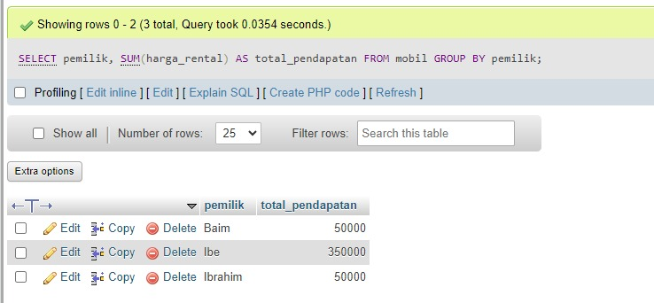

## Berdasarkan praktikum 5 query no 8 tampilkan jumlah pemasukan pemilik berdasarkan harga rental kelompokkan berdasarkan pemiliknya dan seleksi yang total pemasukannya atau harga rentalnya mencapai lebih besar atau sama dengan 300k
### Query 
```sql
SELECT pemilik, SUM(harga_rental) AS total_pendapatan
FROM mobil
GROUP BY pemilik
HAVING SUM(harga_rental) >= 300000;
```
### Analisis
- SELECT pemilik, SUM(harga_rental) AS total_pendapatan: Memilih kolom pemilik dan menghitung total pendapatan (SUM(harga_rental)) untuk setiap pemilik. Hasil perhitungan ini diberi alias total_pendapatan.
- FROM mobil: Mengambil data dari tabel mobil.
- GROUP BY pemilik: Mengelompokkan hasil berdasarkan kolom pemilik.
- HAVING SUM(harga_rental) >= 300000: Menyaring hasil kelompok yang total pendapatannya lebih besar atau sama dengan 300.000.

### Hasil
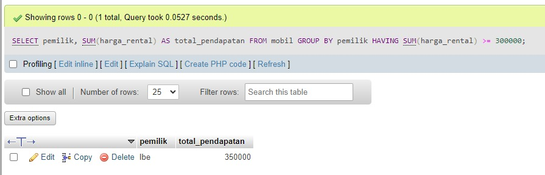

## Berdasarkan praktikum 6 no 12 tampilkan data data pemasukan pemilik mobil kelompokkan berdasarkan pemiliknya
### Query
```sql
SELECT pemilik, SUM(harga_rental) AS total_pendapatan
FROM mobil
GROUP BY pemilik;
```
### Analisis

- **SELECT pemilik, SUM(harga_rental) AS total_pendapatan**: Memilih kolom pemilik dan menghitung total pendapatan (SUM(harga_rental)) untuk setiap pemilik. Hasil perhitungan ini diberi alias total_pendapatan.
- **FROM mobil**: Mengambil data dari tabel mobil.
- **GROUP BY pemilik**: Mengelompokkan hasil berdasarkan kolom pemilik.
### Hasil 

## Berdasarkan praktikum 5 no 16 tampilkan pemasukan  terbesar dan pemasukan terkecil kelompokkan berdasarkan pemiliknya dan seleksi data pemilik yg tampil atau memiliki jumlah mobil lebih besar dari 1
### Query
```sql
SELECT pemilik, 
       MAX(total_pendapatan) AS pemasukan_terbesar, 
       MIN(total_pendapatan) AS pemasukan_terkecil
FROM (
    SELECT pemilik, SUM(harga_rental) AS total_pendapatan
    FROM mobil
    GROUP BY pemilik
    HAVING COUNT(id_mobil) > 1
) AS subquery
GROUP BY pemilik;
```

### Analisis
- Subquery:
- SELECT pemilik, SUM(harga_rental) AS total_pendapatan FROM mobil GROUP BY pemilik HAVING COUNT(id_mobil) > 1: Mengelompokkan data berdasarkan pemilik dan menghitung total pemasukan (SUM(harga_rental)) untuk setiap pemilik, kemudian menyaring hasil hanya untuk pemilik yang memiliki lebih dari 1 mobil (HAVING COUNT(id_mobil) > 1).
- Outer query:
- SELECT pemilik, MAX(total_pendapatan) AS pemasukan_terbesar, MIN(total_pendapatan) AS pemasukan_terkecil FROM subquery GROUP BY pemilik: Dari hasil subquery, mengelompokkan lagi berdasarkan pemilik dan menghitung pemasukan terbesar (MAX(total_pendapatan)) dan terkecil (MIN(total_pendapatan)) untuk setiap pemilik.

### Hasil 
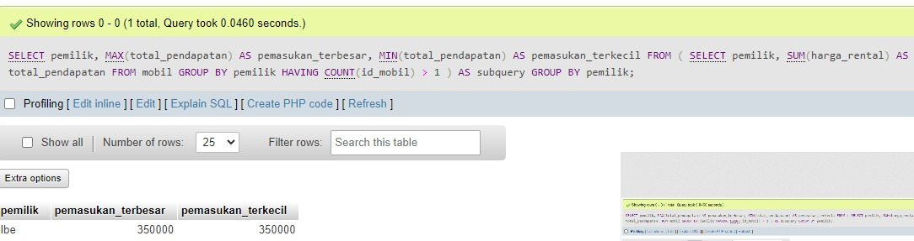